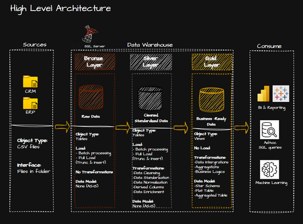
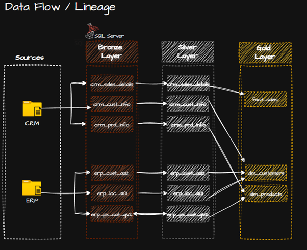
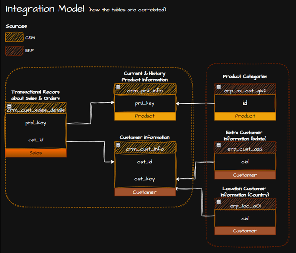
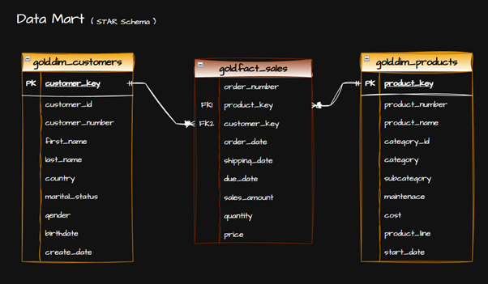

# SQL Server Data Warehouse with Medallion Architecture

A production-style data warehouse built in SQL Server implementing the **medallion (Bronze → Silver → Gold)** layered architecture. Ingests data from two heterogeneous source systems (CRM + ERP), applies systematic data cleansing, and delivers an analytics-ready star schema for downstream reporting.

---

## Tasks Overview

Full project management board (phases, tasks, and status) tracked in Notion:

👉 [Roxani Kyritsi DW Project Board](https://www.notion.so/Data-Warehouse-Project-358b6b0cb5908050a0aac67a260890ec)

---
## Architecture Overview



---

## 🥉🥈🥇 Medallion Layers

### Bronze Layer — Raw Ingestion
| Property | Details |
|---|---|
| Object Type | Tables |
| Load Strategy | Batch Processing / Full Load (Truncate & Insert) |
| Transformations | None (AS-IS) |
| Data Model | None |

Ingests raw CSV files from CRM and ERP source systems with no transformation applied.

---

### Silver Layer — Cleansed & Standardized
| Property | Details |
|---|---|
| Object Type | Tables |
| Load Strategy | Batch Processing / Full Load (Truncate & Insert) |
| Transformations | Data Cleansing, Standardization, Normalization, Derived Columns, Data Enrichment |
| Data Model | None (AS-IS) |

---

### Gold Layer — Business-Ready
| Property | Details |
|---|---|
| Object Type | Views |
| Load Strategy | No Load (view-based) |
| Transformations | Data Integrations, Aggregations, Business Logic |
| Data Model | Star Schema / Flat Table / Aggregated Table |

---

## Data Flow / Lineage



| Source | Bronze Table | Silver Table | Gold Table |
|---|---|---|---|
| CRM | `crm_sales_details` | `crm_sales_details` | `fact_sales` |
| CRM | `crm_cust_info` | `crm_cust_info` | `dim_customers` |
| CRM | `crm_prd_info` | `crm_prd_info` | `dim_products` |
| ERP | `erp_cust_az12` | `erp_cust_az12` | `dim_customers` |
| ERP | `erp_loc_al01` | `erp_loc_al01` | `dim_customers` |
| ERP | `erp_px_cat_gv2` | `erp_px_cat_gv2` | `dim_products` |

---

## Integration Model



Tables are integrated across CRM and ERP sources using shared keys:

- `crm_cust_sales_details` → linked to `crm_prd_info` via `prd_key`
- `crm_cust_sales_details` → linked to `crm_cust_info` via `cst_id`
- `crm_cust_info` ↔ `erp_cust_ae12` via `cst_key / cid`
- `crm_cust_info` ↔ `erp_loc_al01` via `cid`
- `crm_prd_info` ↔ `erp_px_cat_gv2` via `prd_key / id`

---

## Data Mart — Star Schema



### `gold.fact_sales`
| Column | Key |
|---|---|
| order_number | — |
| product_key | FK → dim_products |
| customer_key | FK → dim_customers |
| order_date | — |
| shipping_date | — |
| due_date | — |
| sales_amount | — |
| quantity | — |
| price | — |

### `gold.dim_customers`
`customer_key (PK)`, `customer_id`, `customer_number`, `first_name`, `last_name`, `country`, `marital_status`, `gender`, `birthdate`, `create_date`

### `gold.dim_products`
`product_key (PK)`, `product_number`, `product_name`, `category_id`, `category`, `subcategory`, `maintenance`, `cost`, `product_line`, `start_date`

---

## Consumption Layer

The Gold layer supports:
- **BI & Reporting** (Power BI, SSRS, etc.)
- **Ad-hoc SQL Queries**
- **Machine Learning** pipelines

---

## Repository Structure

```plaintext
├── datasets/          # Source CSV files (CRM & ERP)
├── documents/         # Architecture diagrams & data catalogue
│   ├── High_Level_Architecture.png
│   ├── Integration_Model.png
│   ├── Data_Flow.png
│   ├── Data_Model.png
│   └── data_catalogue.md
├── qa/                # Quality assurance scripts
├── scripts/           # SQL scripts (Bronze / Silver / Gold)
└── README.md
```

---

## Tech Stack

- **Database**: Microsoft SQL Server
- **Language**: T-SQL
- **Diagrams**: draw.io
- **Architecture Pattern**: Medallion (Bronze → Silver → Gold)
- **Data Modeling**: Star Schema
- **Project Tracking**: Notion


